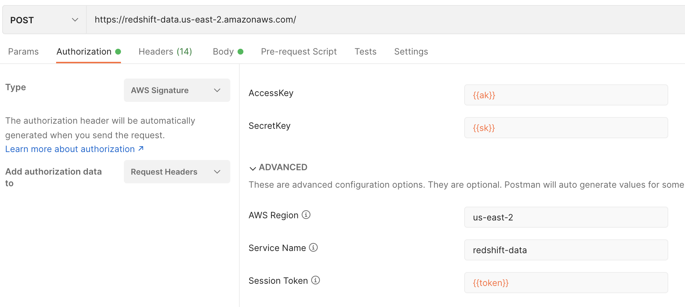

```ad-attention
title: This is a github note

```
# redshift-data-api-lab
```toc
min_depth: 2
max_depth: 3
```

## rest-api
- [postman example](https://github.com/aws-samples/getting-started-with-amazon-redshift-data-api/tree/main/use-cases/rest-api-with-redshift-data-api)
    
### list database


post url: `https://redshift-data.us-east-2.amazonaws.com/`

head:
`x-amz-target`: `RedshiftData.ListDatabases`
`Content-Type`: `application/x-amz-json-1.1`

body:
```json
{
"ClusterIdentifier": "redshift-cluster-1",
"Database": "dev",
"DbUser": "awsuser"
}
```
 
### list tables
head:
`x-amz-target`: `RedshiftData.ListTables`

### execute statement
head:
`x-amz-target`: `RedshiftData.ExecuteStatement`

body:
```json
{
"ClusterIdentifier": "redshift-cluster-1",
"Database": "dev",
"DbUser": "awsuser",
"Sql": "SELECT * FROM \"dev\".\"public\".\"event\";"
}
```


## cli
- [shell/python example](https://github.com/aws-samples/getting-started-with-amazon-redshift-data-api/tree/main/use-cases/ec2-redshift-access)

```sh
aws redshift-data list-tables  --database dev \
    --db-user admin \
    --cluster-identifier redshift-cluster-us \
    --region us-east-1  \
    --table-pattern "prod%" \
    --schema-pattern "rs%"
```

```json
{
    "Tables": [
        {
            "name": "event",
            "schema": "public",
            "type": "TABLE"
        }
    ]
}
```


## reference
- [Get started with the Amazon Redshift Data API](https://aws.amazon.com/blogs/big-data/get-started-with-the-amazon-redshift-data-api/)
- [Using the Amazon Redshift Data API to interact with Amazon Redshift clusters](https://aws.amazon.com/blogs/big-data/using-the-amazon-redshift-data-api-to-interact-with-amazon-redshift-clusters/)

### broken
- [Build a REST API to enable data consumption from Amazon Redshift](https://aws.amazon.com/blogs/big-data/build-a-rest-api-to-enable-data-consumption-from-amazon-redshift/)

us-east-1 only
post data:
```
{
    "createdate": "03/01/2022",
    "productname": "Flower",
    "sku": "FLOWER123",
    "requesttype": "Product"
}
```


